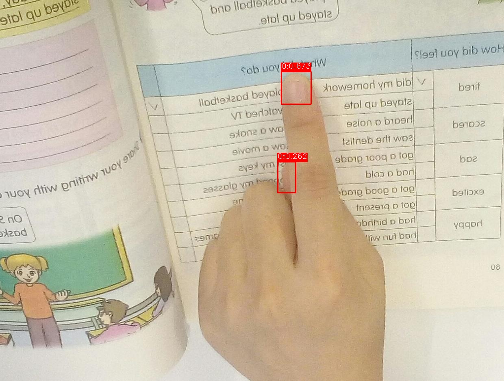

# tflite-finger-detection
基于TF-lite版本的YOLOv3-tiny指尖检测

## 1. 目录结构

```
├── data
│   ├── test_image# 测试图片
│   └── tflite
├── net                             # TF-lite
├── utils                           # 显示相关工具包
├── demo.py                         # Demo文件
├── md5sum.txt                      # md5sum文件
├── README.md                       # 说明文件
├── requirements.txt                # requirements文件
├── result.jpg
└── test.jpg
```
## 2. Platform
- hardware: Intel Core i7-8700 CPU @ 3.20GHz × 12, GPU GeForce RTX 2070 8G
- numpy==1.16.3
- opencv-python==4.1.0.25
- tensorflow-gpu==2.0.0

## 3. 模型输入/输出
```bash
- 模型输入:  input RGB image,shape=(1, 320, 320, 3),(batch_size,height,width,channel)
- 模型输出:  outputs[0] = bboxes = (1, num_bboxes, 4),bbox=[xmin,ymin,xmax,ymax]
            outputs[1] = scores = (1, num_bboxes, num_class),num_class=1
```


## 4. 输入图像预处理函数
```python
    def pre_process(self, image):
        """
	    输入图像预处理:缩放到input_size,并归一化到[0,1]
        :param image:
        :return:
        """
        # use opencv to process image
        input_image = cv2.resize(image, dsize=(self.input_size, self.input_size))
        input_image = np.asarray(input_image / 255.0, dtype=np.float32)
        image_tensor = input_image[np.newaxis, :]
        return image_tensor
```
## 5. 模型输出后处理函数

```python
    def post_process(self, preds_tensor, width, height, prob_threshold=0.2, iou_threshold=0.3, top_k=100):
        """
	    NMS后处理,并将boxes映射为图像的真实坐标
        :param preds_tensor:
        :param width: orig image width
        :param height: orig image height
        :param prob_threshold:
        :param iou_threshold:
        :param top_k:  keep top_k results. If k <= 0, keep all the results.
        :return: boxes  : (num_boxes, 4),[xmin,ymin,xmax,ymax]
                 labels : (num_boxes, )
                 probs  : (num_boxes, )
        """
        boxes, scores = preds_tensor
        boxes, labels, probs = self.np_bboxes_nms(boxes,
                                                  scores,
                                                  prob_threshold=prob_threshold,
                                                  iou_threshold=iou_threshold,
                                                  top_k=top_k,
                                                  keep_top_k=top_k)
        boxes_scale = [width, height] * 2
        boxes = boxes * boxes_scale
        return boxes, labels, probs
```

## 6. Run a demo

-  `TFlite model`
```bash
python demo.py \
    --model_path "data/yolov3_micro0.25_320_320_freeze_head_optimize_float16.tflite" \
    --input_size 320  \
    --prob_threshold=0.2  \
    --iou_threshold=0.3  \
    --image_dir "data/test_image"
```


-  `PB model`:
```bash
python demo.py \
    --model_path "data/yolov3_micro0.25_320_320_freeze_head.pb" \
    --input_size 320  \
    --prob_threshold=0.2  \
    --iou_threshold=0.3  \
    --image_dir "data/test_image"
```


-  `saved_model Run`
```bash
python demo.py \
    --model_path "data/yolov3_micro0.25_320_320_freeze_head" \
    --input_size 320  \
    --prob_threshold=0.2  \
    --iou_threshold=0.3  \
    --image_dir "data/test_image"
```


输出:

```
boxes:[[1699.94781494  562.46815681 1781.12976074  652.66153336]
       [1608.15368652  455.13846874 1680.20324707  538.082757  ]
       [1300.14633179  990.03587723 1401.40975952 1044.56668854]
       [1639.08752441  833.33101273 1740.43579102  908.72314453]
       [1479.4694519   402.31379986 1563.20266724  479.58819866]]
labels:[0 0 0 0 0]
probs: [0.9296721  0.8201085  0.7637726  0.7002182  0.66400814]
```




## 7.Running TF-lite on Android
Android配置TF-lite SSD检测器的方法,可以参考:
> https://github.com/tensorflow/models/blob/master/research/object_detection/g3doc/running_on_mobile_tensorflowlite.md

## 8. 测试结果


|Test|mAP|
|-----|-----|
|VOC|75.84%|
